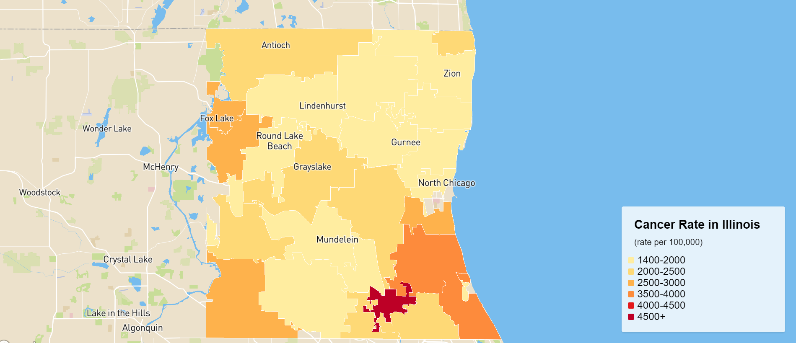

# Cancer Rate in Illinois

## Introduction
Cancer has a major impact on society in the United States and across the world. Cancer statistics describe what happens in large groups of people and provide a picture in time of the burden of cancer on society. Statistics tell us things such as how many people are diagnosed with and die from cancer each year, the number of people who are currently living after a cancer diagnosis, the average age at diagnosis, and the numbers of people who are still alive at a given time after diagnosis. They also tell us about differences among groups defined by age, sex, racial/ethnic group, geographic location, and other categories.**This project mainly visualizes the cancer rate distribution among one of the counties in the illinois and also utlizes the choropleth map as the basemap wihin the lake county area.** Hence, the purpose of this project is to exhibit which city in the lake county has the largest number of cancer diagnoses.
## Data sources
[Cancer Rate in Illinois](https://catalog.data.gov/dataset/cancer-rates)
## Applied libraries and Web Services in use
* https://www.mapbox.com/mapbox-studio/
* https://www.openstreetmap.org/about/
* https://docs.mapbox.com/mapbox-gl-js/api/

## Acknowledgment
Lake County, Illinois; Data.gov; Mapbox; OpenStreetMap.
